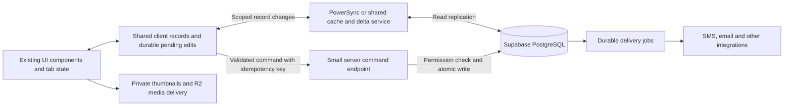

# BE performance feasibility assessment

Assessed September 10, 2026 against checkout `c18b992a20afe29c0b2d6dfa0aabca5b16cc6ee6`. This is an investigation and proposed architecture, not an implemented revamp.

**Conclusion:** Near-instant navigation through already available records and sub-one-second server confirmation for routine edits are credible goals. A guarantee covering first-time launches, every uncached page, external services, large uploads, and all network conditions is not credible. The existing visual design can remain largely unchanged. The work is a substantial change to navigation, data ownership, and mutation execution.

## Evidence collected

The complete existing `npm test` suite passed. A clean production webpack build of the current commit passed, including TypeScript. The build ran in an isolated temporary copy so existing work and development build output were preserved. Compilation/regression success does not prove runtime latency.

Read 165 existing production launch records dated September 6–10. Of these, 152 contain the panel-ready marker. Quantiles below use nearest rank. The newest recorded deployment matches the audited checkout; its nine panel-ready observations have a 6.70-second median, too small a sample for a reliable tail estimate.

| Existing launch measurement | Observations | p50 | p95 |
| --- | ---: | ---: | ---: |
| Initial shell authentication, including MFA/profile checks | 165 | 414 ms | 1,303 ms |
| Initial shell bootstrap RPC round trip | 165 | 227 ms | 893 ms |
| Combined server shell setup | 165 | 706 ms | 1,943 ms |
| Shell hydrated, elapsed from document navigation | 165 | 2,729 ms | 6,422 ms |
| Initial panel bridge ready, elapsed from document navigation | 152 | 5,462 ms | 19,574 ms |
| Paired delay from shell hydration to panel readiness | 152 | 2,626 ms | 7,062 ms |

The final row is calculated per launch before taking quantiles; it is not a subtraction of unrelated percentiles. Stages overlap and must not be added together. RPC duration includes network/API overhead and is not SQL execution time. The initial shell RPC is not all database work: the panel subsequently performs its own reads.

The panel-ready marker comes from the iframe bridge's location/activation handshake. It is a useful startup proxy, not a verified timestamp for every widget being visible and usable. Existing telemetry does not record foreground/background state at every stage, OS application launch time, device identity, or a complete network/CPU breakdown. Samples span deployments and are heavily weighted toward standalone use and Communications. Long-tail observations may include suspended/background activity; they are not a clean contractual p95 baseline. The 13 records without panel-ready markers must not silently be treated as fast completions.

Also read existing mutation telemetry and separated route groups from background activity:

| Existing successful action event group | Observations | p50 | p95 |
| --- | ---: | ---: | ---: |
| Relationship detail routes | 150 | 2,473 ms | 7,587 ms |
| Appointment Setting detail routes | 79 | 2,266 ms | 6,918 ms |
| Settings routes, system category | 9 | 2,012 ms | 2,996 ms |

These groups cover multiple operations, not one isolated save type. Global fetch instrumentation ends at response headers; explicit mutation wrappers end when their operation promise resolves. Neither consistently includes the final rendered frame. Therefore these numbers are reported event durations, not universal end-to-end commit measurements. The latest 1,000 mixed events were dominated by background Communications activity and should not be presented as a representative save benchmark. The per-category sample is capped at 300; see `action-routes.json` for dates and caps.

A small read-only experiment against the live database, from this Mac, produced:

| Request experiment | Samples | p50 |
| --- | ---: | ---: |
| Narrow workspace read | 8 | 106 ms |
| Existing combined shell bootstrap RPC | 8 | 91 ms |
| Three narrow reads in sequence | 6 | 281 ms |
| Three narrow reads in parallel | 6 | 130 ms |

Maximum concurrency was three. This demonstrates the cost of extra HTTP round trips in this environment; it does not prove the same improvement on Vercel or measure authenticated writes. The database-size RPC reported 106,515,603 bytes, about 106.5 MB. Size alone does not establish CPU, memory, or disk health, but there is no evidence here that BE needs a platform intended for enormous datasets.

An isolated production bundle inspection found approximately 133 KB gzip of client-reference chunks for the shell and 239 KB for Communications, excluding root runtime chunks. This is a manifest reference inventory, which can include lazy references, not a measured transfer waterfall. Repeated iframe runtimes can repeat initialization even when downloaded files are browser-cached. Bundle size alone cannot explain the observed delays.

## Structural findings

1. **The shell and panel have separate document lifecycles.** `WorkspaceTopBarClient.tsx` creates iframe panels, keeps three resident, and coordinates routes through a bridge. Existing fast tab switches and the narrowed shell bootstrap are already implemented. A new/unloaded panel still has a separate Next.js document/runtime, permission path, data loading, and bridge lifecycle. Adding PowerSync without changing these dependencies leaves much of that work in place.

2. **Navigation can wait for autosave completion.** `WorkspaceTabBridge.tsx` awaits `flushWorkspaceAutosaves()` before several router transitions. The helper waits for registered flushers or a 1,500 ms timeout. This delay only applies when pending flush work takes time; it is not a mandatory delay on every click. Removing the wait safely requires preserving the user's intent beyond the originating component's lifetime.

3. **Permission and record context is reconstructed through multiple requests.** `getVerifiedUser()` calls Auth; MFA enforcement reads a profile flag; workspace loading reads membership; panel access loads service/capability context; individual actions add record access checks. Guards are necessary, but their computation can be combined, memoized within a request, or represented by narrowly scoped server context. Long-lived unvalidated permission caches are not an acceptable shortcut.

4. **Some panels load substantially more than the visible content.** Communications loads both client and native bootstraps before choosing the visible mode. Native bootstrap requests up to 4,000 messages and the client bootstrap defaults to 2,000, plus rosters, reactions, people and stickers. These are request limits, not observed actual message counts. Relationship loading also combines canonical rows with legacy client fallback records. The first useful panel should depend on a bounded current view, with other modes/history fetched later.

5. **Action completion includes avoidable orchestration.** Appointment Setting reconstructs access/configuration, reads the draft, resolves destinations and portal URL, invokes a submission transaction, then awaits delivery handling and additional bookkeeping. Work-item changes perform several validation/read/write operations and some trigger broad path revalidation. Next.js can include a refreshed server-rendered route in an action response; invalidating several paths does not mean all those pages render immediately. Operations should return a small authoritative result once the required transaction commits.

6. **First media viewing can perform preparation work.** Missing image previews can trigger storage metadata reads, original download, Sharp processing and preview upload during a media request. Move preview preparation to upload/background processing. Preserve the existing private/encrypted delivery requirements.

7. **Several desirable mechanisms already exist.** BE has local filtering in shared list components, optimistic and coordinated chat mutations, offline chat storage, per-record conflict handling, a narrow shell RPC, and onboarding outbox processing. Reuse these principles; do not claim their existing benefit as new PowerSync performance.

## Proposed architecture

Keep Next.js for hosting, public/onboarding routes, authentication and APIs; keep Supabase/PostgreSQL as the authoritative transactional database; keep R2 for files. The workspace becomes one persistent client application with a shared data service.

**One workspace runtime.** Replace iframe-hosted panels incrementally with a panel registry rendered within the shell. Keep independent tab URLs, history, filters, scroll positions, selection and draft state. Retain expensive editors selectively and unmount other views without discarding their state. Share auth/session awareness, data subscriptions and record identities. Existing iframe panels can coexist during migration; a full rewrite is unnecessary.

**Read available data immediately.** Store normalized, bounded record data independently of rendered components. Preload likely panel code and records on intent or idle time. Use a memory cache for hot data and persistence for repeat launches. Update subscribed views by record revision instead of refetching entire pages. Keep explicit network reads for data whose freshness must be confirmed before use.

**PowerSync is a candidate, not a prerequisite.** It supplies persistent SQLite, scoped replication and reactive local reads. It does not automatically convert server-rendered pages into client panels, execute BE's server business rules locally, generate media, or eliminate server writes. Start with a conventional shared client cache if that meets the proof target; choose PowerSync when durable local data and synchronisation justify its integration cost.

For PowerSync, define download permissions to mirror workspace, service, record and participant access. Supabase RLS does not automatically apply to the replicated download path. Keep encrypted Communications on its established authorized path until its key/trust model has been explicitly designed for sync. Test account/workspace switching, access revocation, browser storage eviction, schema upgrades and Safari/iOS persistence. Never create an independent full sync connection for every panel.

**Persist draft intent before allowing navigation.** Write pending edits to a durable client queue and update the visible record immediately where safe. Preserve server versions, request IDs, retries, conflict detection and uncertain-acknowledgement recovery. A queued/local edit remains distinct from a server-confirmed save. This allows route changes to stop waiting for network autosaves without discarding work.

**Make server commands short.** Validate the authenticated identity and perform record authorization, business validation and the write in one narrow transaction/RPC when appropriate. Return the changed record and revision. Parallelize independent reads and avoid routing independent high-frequency operations through one global queue; retain per-record ordering. Keep the application compute near the database. Verify plans and actual CPU/disk/query waits before choosing a larger compute tier.

**Commit critical work before acknowledging success.** If notifications are required, transactionally persist both the business change and a durable delivery job. A worker sends and records delivery status separately. BE already has an onboarding outbox pattern to extend. Do not use an untracked fire-and-forget request or label externally delivered work complete before it is confirmed.

**Make media ready before it is requested.** Prepare thumbnails, reserve dimensions, load only visible media, and use authorized browser caching/prefetching. Video startup, file transfer and upload completion remain constrained by file size and bandwidth.

## Feasible performance targets

These are engineering targets for a prototype, not measured improvements or promises. Define reference hardware, dataset sizes, network conditions and concurrent load before acceptance. Measure both p50 and p95 and report failures/missing observations. Rendering a spinner does not count as meaningful content ready.

| Interaction after revamp | Credible working target | Boundary |
| --- | --- | --- |
| Switch to an already rendered tab | 50–150 ms | Main-thread load still matters; BE already has much of this benefit |
| Navigate to available records with panel code ready | 100–300 ms | Shared/local reads, bounded rendering, no mandatory network gate |
| Open a light uncached panel on a healthy connection | 300–1,000 ms | A target requiring controlled validation; not every cold route |
| Routine edit, visual response | Under 100 ms where safe | Local pending state, not server confirmation |
| Routine edit, server-confirmed transaction | 300–800 ms typical; aim for p95 under 1 s | Consolidated guards/write, nearby services, normal network and load |
| Repeat application launch with persistent code/data | Roughly 0.5–1.5 s after the browser starts the app | OS wake-up, auth refresh and cache eviction can exceed this |
| Fresh install / first visit / fresh large workspace | No universal sub-second target | Downloads, authentication and initial data are unavoidable |
| External message delivery, payment settlement, reports or large uploads | No universal sub-second completion target | Fast durable acceptance is distinct from completed external work |

Google's RAIL model uses a 100 ms response target for interactions that feel instantaneous. Achieving that across ordinary navigation requires removing network waits from those paths, not merely hiding them.

## Rollout and acceptance

1. **Establish a proper baseline.** Extend the current timings to identify the operation, foreground state, route code/data readiness, visible-content paint, server acknowledgement, and external completion separately. Record database/API spans and client CPU long tasks. Current telemetry is useful but cannot certify a service-level target.
2. **Build one representative vertical slice.** Use Relationships list → detail → edit → back/reopen, retaining the current components and CSS. Implement shared state and a narrow mutation path; compare a cached HTTP implementation with PowerSync if persistence is needed. Include an unsaved edit during navigation.
3. **Run representative acceptance tests.** Warm/cold cache, reload and PWA reopen; a midrange iPhone and desktop; normal Wi-Fi and higher-latency mobile; one and several tabs; growing record counts; concurrent users; lost acknowledgement, offline reconnect, conflict, revoked access and account switch. Use test records in a controlled environment for write/load tests.
4. **Migrate only after the slice proves its targets.** Move record panels first, then high-frequency actions, then Communications/media with their dedicated encryption, selection and mobile tests. Retain fallback routes and a rollout switch. Avoid doing a database-vendor migration at the same time.

The current navigation, typography, lists, badges, forms, tabs, menus and detail layouts can be retained. Some server-bound components need to be split into presentation and data-loading parts. Small existing-style pending/error indicators may need to become more precise; wholesale visual redesign is not required.

This is a multi-stage architectural project. The pilot should establish actual effort and performance before any fixed whole-platform delivery estimate. The strongest next investment is that measured vertical slice, not an unvalidated jump to expensive database infrastructure.

## Scope and limitations

No application source, production configuration, subscription, schema, or business record was changed. Tests and read-only requests can naturally create infrastructure logs/cache activity. No authenticated browser CPU/network trace, physical iPhone timing, controlled production mutation, PowerSync prototype, query plan or database CPU/IO profile was obtained. The assessment establishes credible mechanisms and goals, not achieved end-to-end performance.

Files alongside this report contain sanitized aggregate evidence only: `telemetry-summary.json`, `read-benchmark.json`, `mutation-summary.json`, `action-routes.json`, and `bundle-summary.json`.

## References

- Current repository: `components/workspace/WorkspaceTopBarClient.tsx`, `components/workspace/WorkspaceTabBridge.tsx`, `lib/workspace-mutations.ts`, `lib/workspace-launch-performance.ts`, `lib/workspace-shell-bootstrap.ts`, `lib/auth/aal.ts`, `lib/auth/verified-user.ts`, `lib/workspace-access.ts`.
- Current loading/actions: `lib/teams/server.ts`, `lib/communications/bootstrap.ts`, `lib/communications/server.ts`, `lib/relationships.ts`, `app/[workspaceSlug]/appointment-setting/[relationshipId]/actions.ts`, `app/[workspaceSlug]/work-items/[id]/actions.ts`, `lib/onboarding/uploads.ts`, `lib/onboarding/outbox.ts`, `components/GlobalLoadingOverlay.tsx`.
- Installed Next.js guides: `node_modules/next/dist/docs/01-app/01-getting-started/04-linking-and-navigating.md` and `node_modules/next/dist/docs/01-app/02-guides/server-actions.md`.
- [PowerSync Web SDK and browser persistence](https://docs.powersync.com/client-sdks/reference/javascript-web)
- [PowerSync download permissions and Supabase RLS](https://docs.powersync.com/integrations/supabase/rls-and-sync-streams)
- [PowerSync local writes and backend integration](https://docs.powersync.com/integrations/supabase/guide)
- [Next.js navigation and prefetching](https://nextjs.org/docs/app/getting-started/linking-and-navigating)
- [RAIL response targets](https://web.dev/articles/rail)
