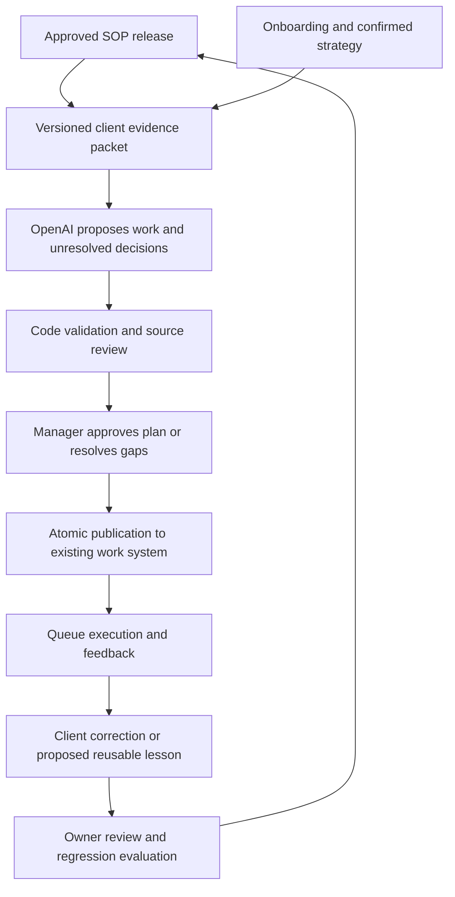

# OpenAI SOP-to-Work implementation plan

Status: proposed, 13 September 2026. This document authorizes no deployment, API spending, or customer-data migration.

## Outcome and boundaries

An admin maintains an SOP container with approved source material. When a particular client service is ready for fulfilment, Betelgeze assembles its relevant evidence, asks OpenAI for a proposed plan, validates it, and presents it for approval. Approved work appears in the existing queue with instructions, source references, attachments, dependencies, and responsibility. Feedback improves subsequent plans through versioned, reviewed knowledge.

We should optimize for fewer unsupported claims and missed requirements, not more confident prose. No model or second review pass can guarantee zero hallucinations. The system must be able to say “missing information” and stop the affected decision.

No manual flow editor is required for the first release. Do not attempt to enumerate every possible client journey or plan future work whose inputs do not yet exist.

## Current foundation and first prerequisite

The local SOP catalogue stores each PDF/DOCX as an asset and supports staff viewing and admin uploads. It does not yet provide containers, extraction, or generation; production verification is still outstanding. See [SOP catalogue](sop-catalogue.md).

The checkout also contains additive service-instance foundations and older relationship-level fulfilment generation. Before implementation, reconcile the current branch and deployed schema with the Work Queue work: identify the authoritative service-instance lifecycle, responsibility, readiness, and queue commands. Earlier conversation reports are not proof of the current deployed state.

There must be one owner of fulfilment generation. Disable or bypass the legacy generator for opted-in services through that owner; never allow both generators to create the same work. Preserve existing clients and completed work. Bind every plan to an exact service instance and work cycle, not just a relationship or service catalogue entry. Preserve the relationship's shared communications context.

## Core flow

## 1. Turn SOP documents into versioned containers

Add a proper SOP record linked to existing assets; preserve asset IDs and existing document access links. A container can include:

- Main procedure and approved revisions.
- Industry/service supplements and applicability conditions.
- Examples, supporting references, images, and explanatory videos.
- Approved lessons from fulfilment feedback.

Give each source a role, revision, approval state, and applicability. Distinguish an example from a requirement: a gym example must not become a dentistry client's instructions. Distinguish agency-wide guidance from a particular client's facts. Only owners/admins edit and publish SOP knowledge; staff retain catalogue and document access.

Uploads initially remain drafts. Process them in the background, show extraction problems, and let an admin publish a coherent knowledge release. An explicit supersedes relationship determines which revision replaces another; uploading a newer file alone does not override everything. Unresolved contradictory requirements block the affected release or decision.

Keep historical releases accessible to authorized users so a work item can still explain its original source. New uploads do not silently alter already approved work.

**Acceptance:** one SOP holds multiple sources; draft content cannot influence live planning; every release can be reconstructed; historical assets remain accessible under current authorization.

## 2. Extract evidence once per source revision

Use a durable background job to extract document text, headings, tables, and usable images. Retain stable source-block IDs and page/section references. Use OCR selectively for scanned pages and mark unreadable or uncertain sections. Parse files with resource limits; document text and embedded instructions are untrusted input.

Store extracted material alongside its original asset, content hash, extraction version, and coverage report. Classify sections as procedure, decision, example, reference, or unresolved. This is a review aid, not proof that extraction understood everything. Never silently treat an unreadable page as empty.

For the first release, allow videos to be attached with an admin-written explanation and optional timestamp. Add automatic transcription and visual analysis later. A transcript alone does not establish what a video demonstrates visually.

Create a compact index of all procedural sections and decision points. Always consider this index and mandatory requirements when planning; use targeted retrieval for detailed passages. Similarity search alone can miss an important prerequisite. Fetch relevant neighboring sections and preserve tables rather than fragmenting conditions from their consequences.

**Acceptance:** source links resolve to the correct revision and location; examples remain identifiable; extraction gaps are visible; unchanged source files do not incur repeated processing.

## 3. Assemble an authorized client evidence packet

Start with these bounded sources for the exact service instance:

1. Purchased scope and service responsibility.
2. Relevant completed onboarding answers and reviewed uploads.
3. Confirmed strategy-call notes and decisions.
4. Relevant relationship facts and existing service work.
5. Applicable approved SOP release and lessons.

Make completion and confirmation of strategy notes a real readiness condition, with actor and revision recorded. Preserve other existing readiness requirements. Planning may report gaps before readiness, but executable fulfilment work cannot be published until the required conditions hold.

Keep client facts separate from recommendations. Each fact carries its source and confirmation status. An example budget is never the client's budget. An unresolved disagreement between onboarding and strategy becomes an explicit question; “latest text wins” is insufficient.

Initially exclude free-form Comms from automatic context. Add scoped retrieval of relevant client conversations after the first service passes evaluation, with drafts and casual statements distinguished from confirmed decisions. Allow an authorized person to promote a relevant message into a confirmed strategy decision in the first release.

Enforce workspace, relationship, service, and source permissions in code on every retrieval and again on publication. Background workers act under explicit capabilities. Exclude credentials, unrelated clients, and unrelated sensitive records. Record missing/redacted evidence as unavailable rather than inventing a substitute. Documents and messages cannot grant tools or change system instructions.

Pin source revisions for each run. If readiness, scope, assignment, or relevant sources change before publication, require revalidation and present the difference.

**Acceptance:** cross-client retrieval fails; incomplete strategy blocks publication; conflicting facts are surfaced; a plan's inputs can be reconstructed without retaining unnecessary sensitive logs.

## 4. Generate a structured draft, then validate it

Use a server-side OpenAI integration with bounded read tools and a strict output schema. Keep credentials in server secret storage. Select a supported model using representative evaluations; version the model/configuration, prompt, schema, extraction, and retrieval policy. Do not pick solely by price or reputation.

Each proposed work item includes:

- Stable draft ID, title, actionable instructions, and completion criteria.
- Basis: SOP requirement, confirmed client strategy, or AI recommendation.
- Evidence references supporting client-specific facts and procedural choices.
- Dependencies and required, conditional, or deferred status.
- Attachment asset IDs and valid page/timestamp locations.
- Proposed responsible role/person constrained to the existing responsibility model.
- A short decision explanation and any unresolved prerequisite.

The plan also lists missing information, conflicts, applicable requirements covered, and consequential steps omitted with reasons. These explanations are user-facing audit data, not private chain-of-thought.

Default to evidence-bound planning. Optional improvisation may propose additional work, but cannot invent facts, silently change purchased scope, or publish unapproved recommendations. For a choice such as lead form versus landing page, cite the client's relevant follow-up capacity; if unknown, request that information. For future testing/scaling decisions, create a measurement checkpoint and plan the next stage after results exist.

Code validates schemas, source ownership, attachment existence/access, scope, assignees, dependency cycles, duplicate work, readiness, and stale versions. A focused model review checks support, contradictions, and omissions against the original evidence. It is another fallible check: a valid citation proves a source exists, not that it supports the claim.

Handle refusal, incomplete output, timeout, and budget exhaustion as explicit run states. Never publish partial output. Structured Outputs constrain format but can still contain mistakes, as [OpenAI documents](https://developers.openai.com/api/docs/guides/structured-outputs).

**Acceptance:** invalid or stale plans cannot publish; invented source/attachment IDs fail; missing evidence can yield a useful blocked plan; a repeated event cannot create duplicate work.

## 5. Publish through the existing work commands

Build one reusable, permission-checked plan publication command used by the review UI and future integrations. The AI has no direct SQL or unrestricted work-item write access.

Use a durable job/outbox with bounded retries, worker leases, and idempotency tied to service instance, cycle, and generation request. Record states such as queued, running, needs information, needs review, published, failed, and cancelled. A retry after a lost acknowledgement must recover the original result.

Publish an approved plan transactionally: items, dependency links, responsibility, attachments, provenance, and the cycle link either all succeed or none do. Recheck current authorization and expected versions inside the publication boundary. Do not advance service stages merely because a model says work is ready or complete.

Queue eligibility remains deterministic: authorized responsibility and dependency readiness come before priority. The AI suggests sequence within a service; existing queue policy resolves competing services. No model call runs when a staff member opens or refreshes the queue.

**Acceptance:** concurrent retries publish once; dependency-blocked tasks do not appear as actionable; lifecycle transitions retain their existing authority; manual work remains available if generation is disabled.

## 6. Make review and correction quick

Initially, every generated plan requires a fulfilment manager or explicitly authorized reviewer to approve it. Show the complete plan, unresolved decisions, source links, and recommendations together. Reuse existing panel, detail, list, assignment, and work-item primitives under `docs/ui-standards.md`.

In the queue, provide “Why this task?”, source/attachment access, edit, dispute, and add-missing-work actions. Capture reasons with a short choice and optional explanation: wrong client fact, not applicable, outdated source, missing prerequisite, duplicate, unclear instructions, wrong order, or other.

Store the proposal, approved version, subsequent edit, actor, reason, relevant source versions, and resolution. A dispute must support an auditable hold on affected work; downstream dependencies cannot proceed through an unresolved required task. Do not silently delete tasks or discard comments and progress.

Whole-plan review matters: staff cannot dispute a task the AI forgot to create. Explicitly ask reviewers about missing work, and periodically audit completed plans as well as individual disputes.

## 7. Improve through approved knowledge, not automatic self-rewriting

Use three separate feedback paths:

| Feedback scope | Result | Control |
| --- | --- | --- |
| This client only | Correct client evidence and propose an affected-work update | Authorized client/service editor; preserve history |
| Reusable SOP lesson | Draft an applicability rule or improved instruction linked to the dispute | SOP owner/admin approves a new knowledge release |
| Generator behavior | Propose prompt, retrieval, or model changes | Evaluation gate and controlled software/configuration release |

Example: “This client cannot respond within ten minutes” corrects that client's plan. It does not establish a universal rule against lead forms. If the SOP already defines that condition, the failure may be retrieval or reasoning rather than missing SOP knowledge. Diagnose the cause before adding redundant instructions.

Let the system summarize recurring disputes and propose lessons. Require evidence and applicability, merge duplicates, and resolve conflicts. Do not let it promote its own generated text into authoritative knowledge. Accepted tasks are weak positive signals; acceptance and completion alone do not prove correctness or business effectiveness.

When an SOP release changes, identify affected open plans and propose a reviewable difference. Preserve started/completed tasks, history, and user edits. Automatically use the new approved release for future runs; updating existing work is a separate authorized operation with dependency checks.

Keep reusable lessons free of another client's private facts and scoped to the workspace. Maintain rollback for knowledge and generator versions. Start with retrieval of approved lessons; consider fine-tuning only after sufficient reviewed examples demonstrate a persistent problem that prompting/retrieval cannot solve economically. Uploads and feedback do not themselves retrain the base model.

## 8. Evaluate before and during rollout

Build the evaluation harness alongside the first vertical slice, before expanding services. Start with one SOP and roughly 20–30 expert-reviewed, varied client cases as a pilot dataset, then expand. This is a starting sample, not evidence of general reliability. Include held-out cases that are not used to tune prompts or write lessons.

Cover different industries, budget levels, missing strategy, contradictory notes, outdated revisions, unreadable pages, conditional branches, irrelevant examples, malicious document instructions, existing work, changed permissions, and retry/concurrency failures. Repeat representative model runs to expose variability. Score against requirements and prohibited decisions rather than one exact wording of a plan.

Track separately:

- Unsupported client facts and source claims.
- Critical missing work and unnecessary/out-of-scope work.
- Incorrect applicability, dependencies, responsibility, or attachments.
- Reviewer correction rate and review time.
- Useful handling of missing information versus unnecessary blocking.
- Cost and latency per import, plan, retry, and revision.

Code checks hard invariants. Human reviewers calibrate semantic scoring; a model grader alone is insufficient. Compare against a human-created baseline. Add real failures to regression cases while preserving a separate held-out set. This follows OpenAI's recommendation for task-specific, ongoing evaluation with [human-calibrated scoring](https://developers.openai.com/api/docs/guides/evaluation-best-practices).

Pilot gate: all security/publication invariants pass, no unresolved critical failures in the evaluated cases, and the service owner accepts plan quality and review effort. These are finite-test results, not a zero-error guarantee. Publish automatically only in a later opt-in phase for narrowly validated situations; never use the model's self-reported confidence as the sole gate.

## Cost, privacy, and performance

Default development to recorded fixtures with no API calls. Separate economy experiments, production-model evaluations, and live runs. Separate test/production credentials and enforce server-side per-run and aggregate spending budgets, including reserved concurrent spend, retries, tool calls, and maximum output. Display actual usage; stop rather than silently escalating to a more expensive model. Set any paid evaluation allowance before enabling it.

Reuse extraction by content hash and retrieve bounded evidence. Reuse an unchanged draft rather than regenerate on every UI edit. Revalidate live conditions even when reusing cached output. Measure actual costs before promising a per-client price.

API data is not used for model training by default, but retention depends on features and controls. Review the selected endpoint, file-storage, and logging settings against [OpenAI's data controls](https://developers.openai.com/api/docs/guides/your-data); do not describe `store: false` as universal zero retention. Apply retention/deletion rules to local evidence, derived indexes, traces, and external stored files. Keep authorization current even for historical citations.

Follow `app_speed.md`: extraction and generation stay off navigation and interactive write paths; catalogue and queue reads remain paginated/indexed; do not install a workspace-wide scanner, global polling loop, or eager document download. Reuse the existing durable invalidation/event mechanism and load source previews on demand. Validate cold/warm navigation, query plans, bounded payloads, and realistic concurrency before rollout. Distinguish authenticated browser testing, mobile emulation, physical-device testing, and production evidence.

## Delivery sequence

| Milestone | Deliverable | Exit condition |
| --- | --- | --- |
| A — foundation | Verify current service/queue owners; define strategy readiness and publication contract | No competing generators or ambiguous service scope |
| B — evidence | SOP containers/releases, extraction, source viewer, bounded client packet | Human can inspect exactly what a run will use |
| C — one service | Draft generator, validators, review, atomic publication, replay/evaluation harness | Representative pilot passes with mandatory review |
| D — learning | Queue disputes/edits/missing-work capture and reviewed lessons | A real correction improves future evaluated plans and is reversible |
| E — expansion | More services, scoped Comms, richer video processing | Each addition passes its own retrieval and planning checks |
| F — optional autonomy | Narrow automatic publication and later-stage replanning | Measured reliability supports that scope; immediate rollback available |

Ship C and the basic feedback capture/lesson approval from D together for the first pilot. Advanced pattern mining can follow. Keep automatic transcription, unrestricted workspace exploration, fine-tuning, and autonomous scope changes outside the first release.

Implementation records should cover SOP/source releases, client evidence snapshots, generation runs and draft versions, work-item provenance, feedback/lessons, and evaluation results. Reuse assets, work items, dependencies, assignments, and the verified service-cycle foundation rather than creating a second work system. Final table names and migrations follow the foundation audit.

Roll out behind a workspace/service feature flag with test clients first. Verify real storage access, worker recovery, authorization, and authenticated queue behavior before live use. A rollback disables new generation/publication while preserving approved work, its sources, and manual editing. No automatic migration of historical clients is part of this plan.

The first implementation should be a complete path for one service: approved documents + confirmed client evidence → reviewed work plan → queue → correction → approved lesson → improved subsequent plan. That proves the product and its learning loop before widening its reach.
