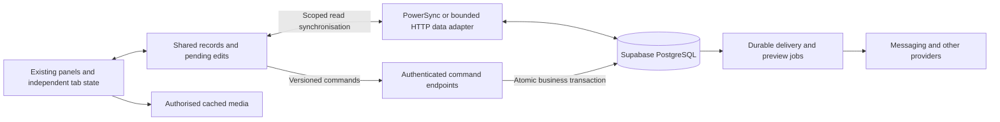

# BE workspace performance implementation plan

Prepared September 10, 2026. Status: **partially implemented in the performance PR; not enabled or deployed**. See [implementation and validation status](workspace-performance-implementation.md) for the exact delivered scope, release gates, and remaining phases. The targets below remain acceptance goals, not measured outcomes.

## Outcome

Make everyday navigation feel immediate, make ordinary edits respond immediately and normally reach the server in under one second, and substantially reduce repeat launch and media waiting. Preserve BE's existing visual design, navigation conventions, permissions, business rules, and recovery behaviour.

The principal change is to turn the workspace into one persistent application with shared records, independent tab state, and durable pending edits. Next.js, Supabase/PostgreSQL, and R2 remain the foundation. PowerSync is the preferred service to evaluate for persistent record synchronisation; it is a component of the revamp, not a replacement for the revamp.

This plan covers the whole platform. Relationships is the first working proof, followed by migration of the remaining modules. Completing the proof alone does not complete the project.

## Evidence and starting point

The [September 10 assessment](performance-baseline/assessment.md) contains the measurements and their limitations. Existing telemetry showed median shell hydration of 2.73 seconds and panel-bridge readiness of 5.46 seconds. Relationship-detail action events had a 2.47-second median. These are mixed historical samples and imperfect timing markers, not clean measurements of every screen or save.

The audit tested commit `c18b992a`. Plan preparation also reviewed `20921f19`, which changes Retention portal delivery and consent handling. Implementation must start from the then-current source and database state. Concurrent archive-related migration/tests and other working files belong to separate work and must be preserved.

The audit's tests and clean production build passed. That validates the audited code, not this proposed architecture. Authenticated browser profiling, controlled write benchmarks, database execution plans, and physical iPhone performance remain to be collected.

## Performance contract

These are proposed acceptance targets, not achieved results. Phase 1 fixes the reference devices, foreground state, representative data volumes, network profile, and concurrent load. Measure interaction to meaningful usable content, rather than to a spinner or response headers.

| User interaction | Target under reference conditions | What counts as completion |
| --- | --- | --- |
| Switch to a resident tab | p95 at or below 150 ms | Correct content visible; controls respond |
| Navigate with required records and panel code available | p95 at or below 300 ms | Useful destination content visible and interactive |
| Open a light uncached panel | Typical 300–1,000 ms; establish and report its tail separately | First useful view; no universal sub-second promise |
| Edit an ordinary field | p95 visual response below 100 ms | Local change visible with accurate pending state |
| Confirm a routine edit on the server | Typical 300–800 ms; target p95 below 1,000 ms | Authoritative transaction acknowledged and reflected locally |
| Repeat PWA launch with usable persisted state | Typical 0.5–1.5 seconds; initial p95 goal below 2 seconds | Restored panel usable, measured after browser application start |
| View an already cached thumbnail | p95 below 300 ms | Image painted at the correct dimensions |
| Submit work requiring an external provider | Aim for durable acceptance below 1 second where feasible | Business transaction and delivery job committed; delivery measured separately |

First installation, expired authentication, storage eviction, large downloads/uploads, external delivery, and slow networks have separate measurements. They are not quietly removed from reporting. Provider delivery, payment settlement, and generated reports must never be labelled complete merely because BE accepted the request.

## Architecture decisions

1. **One workspace runtime.** Extend the existing panel registry and render migrated panels inside the persistent shell. Legacy frames coexist temporarily behind a rollout switch.
2. **One shared record service.** Components read typed records and subscriptions through a small application interface. Data survives panel unmounts. Each tab owns its own navigation and view state.
3. **One mutation owner per entity.** Pending changes have durable storage, request IDs, server versions, and ordered execution. Existing chat and appointment queues are adapted carefully rather than duplicated.
4. **Authoritative server commands.** The server validates identity, permissions, business rules, and concurrency. Local state cannot grant access or confirm a business transaction.
5. **Durable background delivery.** Notifications and other external work run from committed jobs with observable delivery status.
6. **Bounded startup work.** Load the visible mode and useful records first; fetch other data, code, and media according to actual need.

### PowerSync decision

Evaluate PowerSync early, before migrating multiple modules or building a bespoke replication system. Its Web SDK supplies browser SQLite and reactive synchronised reads; browser storage and multiple-tab behaviour require deliberate configuration and testing. [PowerSync Web SDK](https://docs.powersync.com/client-sdks/reference/javascript-web)

Use the Relationships proof to compare ordinary shared HTTP caching with a narrowly scoped PowerSync integration. The decision considers repeat launch, local navigation, initial sync volume, memory, battery/background work, Safari reliability, permission fidelity, operational cost, and maintenance burden. A good in-memory tab switch alone is insufficient evidence for choosing it.

If PowerSync passes, use it for appropriate staff record downloads and keep BE's command API responsible for writes. Select exactly one durable upload/command mechanism per entity; do not let PowerSync's upload queue and a separate application queue send the same change. If it fails the browser or permission gates, retain the HTTP adapter and durable draft store; report any weaker persistence/performance outcome rather than claiming equivalent results.

Download permissions must be defined explicitly: Supabase RLS does not automatically secure PowerSync downloads. Test workspace, service, relationship, team, participant, and admin visibility independently, including removal of access. [PowerSync RLS and Sync Streams](https://docs.powersync.com/integrations/supabase/rls-and-sync-streams)

Encrypted Communications and token-based portal data initially retain their established authorised paths. Moving their protected content into sync requires a separate, demonstrated encryption and access design within the relevant migration phase.

## Phase 1 — Inventory and trustworthy measurements

**Deliverables:** route/action coverage matrix, reproducible benchmark harness, baseline report, and rollout controls.

- Inventory every workspace route, nested screen, mutation, background refresh, integration call, and relevant standalone portal/onboarding route. Record the data owner, permissions, completion meaning, and migration status.
- Capture existing desktop/mobile layouts and important interactions using controlled accounts and records. Protect current Retention consent, client-specific teams, archive rules, portal revocation, and appointment submission behaviour.
- Extend launch and action telemetry with operation names, deployment version, foreground state, cache state, data/code readiness, first useful paint, local durability, server acknowledgement, and external completion. Keep business content and credentials out of telemetry.
- Correlate browser timings with server auth, access, query, transaction, and response spans. Capture network waterfalls, long tasks, actual transferred bytes, duplicate requests, and subscriptions.
- Verify Vercel execution region, Supabase region/tier, database CPU/IO/connection waits, and expensive queries. Use bounded read-only inspection in production; write/load tests use controlled staging fixtures and disabled external delivery.
- Benchmark representative small/current/grown datasets, including skewed large conversations. Collect at least 100 repeated automated observations per important reference case where practical; report actual physical-device sample counts and uncertainty separately.

**Exit:** we can identify where each representative action spends time and compare the old and new paths under the same conditions. Missing, failed, and suspended observations remain visible.

## Phase 2 — Shared data, persistence, and command foundations

**Deliverables:** typed data interface, chosen persistence adapter, command protocol, and tested access boundaries.

- Define bounded list summaries, record details, query keys, revisions, deletions, freshness requirements, and subscriptions. Avoid copying raw database rows or sensitive columns into browser models.
- Scope storage and subscriptions by account and workspace. Coordinate browser windows so duplicate workers and competing writers do not corrupt state. Bound record/media retention and initial sync; keep large historical data on demand.
- Reuse request-scoped auth/access results and consolidate dependent checks where safe. Keep MFA, re-enrolment, revocation, service access, and record authorisation intact.
- Define commands with an operation, entity ID, idempotency key, expected server version, and validated changed fields. Return the authoritative result, version, and structured error/conflict state.
- Make idempotency transactional and scoped to the authenticated operation; reject key reuse with different input. Recover a lost acknowledgement without applying the action twice.
- For HTTP command routes, explicitly preserve protections formerly supplied by Server Actions: authenticated identity, origin/CSRF controls, payload limits, validation, and bounded responses. Never accept the actor or workspace authority merely because the client supplied it.
- Persist edit intent before navigation can discard the originating component. Keep per-record ordering, coalesce safe repeated field edits, and prevent an older response or sync event from erasing newer input.
- Classify operations: ordinary edits can project locally; irreversible or multi-record business transitions require authoritative confirmation; external work has separate accepted/delivered states.
- Handle disk-full/private-browsing/storage-failure cases honestly: if neither durable storage nor server confirmation succeeds, retain the draft and prevent silent loss. Browser persistence cannot guarantee survival of OS/browser eviction.
- Preserve account/logout clearing rules. Pending work must be resolved or explicitly handled in the originating account before clearing; it must never replay as another account. An expired/MFA-blocked session locks protected views. Document offline retention and expiry: an offline device cannot receive instant revocation or remote erasure.

**Exit:** deterministic tests prove ordering, retry safety, isolation, rejection, conflict handling, and recovery through unmount/reload before navigation stops awaiting autosaves.

## Phase 3 — Persistent shell and complete Relationships proof

**Deliverables:** native Relationships list/detail/edit flow within the existing workspace appearance.

- Extend `lib/workspace-panels.ts`, `lib/workspace-tabs.ts`, and the shell's rendering contract. Split server loaders from reusable presentation components; do not import server-only code into the client panel registry.
- Give each workspace tab its own route, query parameters, history, filters, selection, scroll, and draft references. Synchronise the active tab with the browser URL without making inactive tabs depend on a shared global query string.
- Preserve deep links, reload, browser back/forward, workspace back/forward, adjacent tab insertion, modifier-click, new-window behaviour, relationship context, keyboard focus, and existing tab limits.
- Share session awareness, presence, data subscriptions, and record identities. Retain expensive editors selectively; release hidden rendering work without losing view state or pending edits.
- Preload likely panel code and records on intent or controlled idle time. Bound concurrent prefetch and suspend unnecessary work in hidden tabs; do not preload the whole workspace.
- Migrate Relationships list → detail → edit → immediate navigation away → reopen. Include multiple tabs observing the same relationship and concurrent edits from another session.
- Show an already available authorised snapshot immediately; reconcile in the background without resetting fields, selection, or scroll. Show errors locally using existing shared primitives.

**Exit:** the proof meets cached navigation and routine-edit targets, passes functional/visual comparisons, and recovers from offline/lost-response/conflict scenarios. If it misses, profile and correct the cause before multiplying the design across modules. This is an engineering gate, not an automatic pause for another approval.

## Phase 4 — Short server transactions and reliable background jobs

**Deliverables:** fast representative commands, narrowly refreshed records, and durable external delivery.

- Prioritise relationship changes, work-item edits, appointment draft saves/submission, and common settings actions using the operation-specific baseline.
- Combine dependent validation/read/write steps in a narrow transaction/RPC where appropriate. Preserve exact permission and lifecycle checks, atomic audit requirements, and expected-version conflicts. Inspect query plans before adding indexes.
- Parallelise truly independent server reads. Avoid client-wide action queues for unrelated entities; preserve ordering where operations depend on one another.
- Return changed records and affected summaries. Replace blanket mounted-panel reloads with record updates and narrowly scoped invalidation, including counts and permissions where relevant.
- Keep Server Actions where appropriate. The installed Next.js version serialises client-dispatched actions and may include current-route rendering in revalidation responses; simply wrapping calls in `Promise.all` is not the solution. Use explicit command routes where independent execution is needed.
- Extend the existing onboarding outbox pattern. Commit business changes and required delivery jobs together. Workers use leases, bounded retries, backoff, idempotency, failure visibility, and uncertain-provider-response reconciliation.
- Preserve approved-channel/consent checks and re-check conditions that may change before delivery. Never make performance tests send real SMS, WhatsApp, email, payments, or booking requests.

**Exit:** controlled routine writes meet the server-confirmation target; retries and worker crashes produce neither lost business changes nor duplicate logical deliveries. Where a provider cannot guarantee deduplication, retain and expose uncertain delivery instead of promising exactly-once transmission.

## Phase 5 — Migrate every remaining screen

The following is the initial coverage map; Phase 1 adds nested settings/forms and any routes introduced before implementation. Each row receives data, mutation, navigation, visual, and latency checks.

| Module | Migration work and essential regression coverage |
| --- | --- |
| Relationships | Finish all detail tabs, create/edit/archive and Retention/POS transitions; preserve staffing, consent, and portal handoff rules |
| Fulfilment / Work | Relationship queues, selected work, assignments, stages/dependencies, completion, related counts |
| Library | Work-item and asset lists/details, editors, attachments, status and ownership changes |
| Appointment Setting | Lists, drafts, availability, booking/outcomes; preserve conflict recovery, timezone/DST validation, atomic submission, and delivery status |
| Onboarding management | Relationship lists/details, saved submissions, resume/restart/revoke, completion, and dependent lifecycle updates |
| Settings | Inventory all subsections; make ordinary configuration changes local and narrowly confirmed while keeping provider verification server-authoritative |
| Admin | Dashboard, maintenance, activity/detail, OKRs/detail; paginate history and keep expensive calculations off initial navigation |
| Lead Gen | Dashboard, polls, new poll, poll detail; preserve live progress and navigation while processing runs in the background |
| Communications | Client and native/team modes; dedicated migration in Phase 6 |
| Shell and access routes | Home/restore, search, create modal, context panel, no-access, workspace/account switching, mobile navigation |
| Onboarding Builder | Preserve its intentional standalone-window contract; improve its shared reads, editor loading, and saves without forcing it into a workspace tab |
| Client portal and public onboarding | Retain token/custom-domain routing and their existing layouts; optimise shared backend/media paths, progressive loading, and save/resume without sharing staff caches |

Use existing `components/ui`, `components/panel`, `components/list`, and `components/detail` primitives. Keep component geometry and interaction behaviour. Any necessary pending/conflict feedback must fit existing styles. If the documented data/offline behaviour changes, update `docs/ui-standards.md` and relevant behaviour documentation with the implementation.

**Exit:** every inventoried route/action is migrated, already meets its budget, or has an explicit justified server/external constraint with measured behaviour. No generic “remaining panels later” bucket.

## Phase 6 — Communications and media

**Deliverables:** fast conversation entry, bounded history, coherent live updates, and prepared media.

- Load only the initially visible client/native mode. Fetch conversation summaries and a bounded selected-message window; defer the other mode and older history.
- Preserve unread totals, search coverage, reactions, replies/quotes, participants, deleted records, and links to older messages. Load an anchored window for an old-message target instead of requiring all history first.
- Reuse coordinated updates, request IDs, offline recovery, and tombstones. Ensure a refresh cannot overwrite a pending send, edit, reaction, or checklist change.
- Share appropriate subscriptions and pause hidden work. Keep presence ephemeral and separate from durable records. Reconcile after reconnect without reloading the active conversation.
- Keep encrypted message, key, and private attachment authorisation intact. Validate participant changes and access removal against the real RPC/key path.
- Generate image previews as part of upload processing or a durable background job. Use a bounded backfill for older files. The first viewer should not normally pay for downloading and resizing the original.
- Preserve private media proxy/cache requirements, dimensions, conditional requests, and video/audio ranges. Cache keys include content revision and correct access scope; no storage encryption secrets enter the browser.
- Test composer focus, text selection, quoting, pinch/zoom, checklist interaction, scroll anchoring, and popup positioning. Keep one viewport owner in each workspace/standalone context.

**Exit:** conversation switching and available-media display meet their budgets with no encryption, message-loss, unread-count, or mobile interaction regression.

## Phase 7 — Launch, resources, and infrastructure

**Deliverables:** fast repeat startup, bounded resource use, and a measured recurring-cost recommendation.

- Restore the shell and required tab state first. Hydrate usable persisted records without waiting for unrelated panels, and reconcile with fresh authorised data.
- Keep cached application code/version metadata separate from private records. Never service-worker-cache arbitrary authenticated HTML, API responses, session tokens, or portal URLs. Preserve static offline recovery for failed startup.
- Test old/new application versions, service-worker updates, database/storage upgrades, quota pressure, lock/unlock, and authentication expiry. Do not activate an incompatible version while losing queued edits.
- Measure real JS/CSS transfers and runtime work. Defer editors, maps, analytics, and specialised libraries until needed; inspect server tracing/package footprint before changing it. Bound memory and subscription growth across repeated tab churn.
- If profiling confirms a region mismatch, prepare application/database co-location with a concrete migration and rollback procedure. Select compute changes from measured CPU/IO/query waits, not database size or tier names.
- Document the exact proposed recurring services, configuration, current quote, expected benefit, and remaining usage charges before any purchase. PowerSync or larger Supabase/Vercel tiers require an explicit paid-service decision if not already authorised. Keep progressing with local/staging work that does not depend on that purchase.
- Do not combine this revamp with a database-vendor migration. A move to another database platform requires separate evidence that the optimised current stack cannot meet the required workload.

**Exit:** repeat-launch improvement is measured, the resource footprint is stable, and any paid upgrade has a specific demonstrated purpose.

## Phase 8 — Verification, rollout, and cleanup

**Correctness checks:** meaningful queue/command tests; focused workspace, access, offline, Communications, media, appointment, and onboarding suites; SQL transaction/RLS/idempotency tests in an isolated database; full `npm test`; changed-file lint; `git diff --check`; and a clean production build. Read the installed Next.js guides when modifying framework boundaries. Do not use source-string assertions alone to prove runtime behaviour.

**Authenticated end-to-end checks:** owner/admin, service-scoped staff, restricted staff, and portal users; multiple workspaces/browser windows; warm and cold entry; edits during navigation; concurrent modification/deletion; lost acknowledgements; offline reconnect; denied storage; expired/revoked access; and old-client/new-server compatibility. Exercise cross-module workflows such as POS → sale → consent → onboarding/team allocation → delivery and Retention → consent → portal/Communications.

**Visual and physical-device checks:** compare the captured layouts; test keyboard and pointer use, tab history, popup stacking, focus and selection. Test actual iPhone Safari and installed PWA behaviour, including keyboard/emoji height changes, rotation, suspension, zoom, and recovery. Browser screenshots/build success are not physical-device verification. If device access is unavailable, record that gate as outstanding.

**Performance checks:** compare matched datasets/builds and reference conditions. Report p50/p95, sample counts, failures, cold/uncached cases, and resource usage. Add regression checks for agreed budgets; keep noisy measurements separate from deterministic correctness tests. Do not load-test production without separate authorisation.

**Deployment sequence:** add backward-compatible schema/commands first; release disabled client paths; enable the complete proof for a controlled workspace; expand by module/workspace after correctness and performance gates; monitor launch, action failures, queue age, sync lag, and memory. Use the release authority given in the implementation request rather than assuming this planning request authorises deployment.

**Rollback:** feature switches restore the old panel renderer and data path. Both paths must understand pending edits or safely reconcile them before switching. Rollback must not drop committed jobs, erase drafts, undo unrelated migrations, or require destructive database restoration. Test rollback with pending and uncertain writes.

**Cleanup:** after the migration is verified and old clients have aged out, remove obsolete frame-only coordination, duplicate loaders, redundant subscriptions, broad reload paths, and unused flags. Keep intentional standalone routes and documented recovery paths. Leave a concise operations guide for sync, queues, media jobs, migrations, and performance regressions.

## Definition of done

- [ ] Full route/action matrix completed, including standalone and portal boundaries.
- [ ] Shared workspace runtime and record ownership implemented without substantial visual changes.
- [ ] Ordinary edits survive navigation and reconnect without being mislabelled as server-saved.
- [ ] Permission, MFA, consent, encryption, lifecycle, and concurrent-edit rules preserved.
- [ ] Measured navigation, routine-save, repeat-launch, and media results reported against the contract.
- [ ] Remaining slow operations individually explained, with local acceptance distinguished from external completion.
- [ ] Automated, authenticated visual, database, deployment, and physical-device evidence labelled separately.
- [ ] Gradual rollout and rollback exercised; old code cleaned up after compatibility gates.
- [ ] Exact recurring costs and operational responsibilities documented for any service adopted.

Implementation should proceed phase by phase, keeping this checklist current and fixing failed gates before broadening the rollout. The first proof determines whether the proposed targets and service choice hold up in BE. The final delivery is the platform-wide migration and its evidence, not a faster demo or a subscription purchase.
